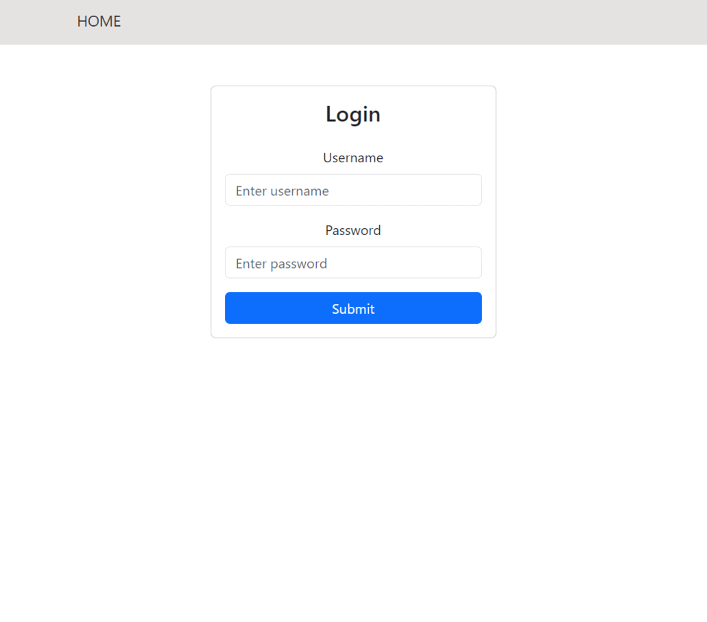

# React Polls Project

A web app that lets users create and answer polls. Built with React, Redux Toolkit, and Bootstrap.

# Context 

This is the assessment project for Udacity's React Redux course.

The goal is to create a polls app allowing users to create and answer polls. Users can login, answer polls, create new polls, and see their ranking in the leaderboard.

For the moment, the project is focusing on the frontend only. The data is retrieved through a simple API file provided by Udacity. In the future, I will add a backend that will be shared in another repository.

# Getting Started

## Prerequisites
- Node.js 16+
- npm 8+

## Installation

Execute the following commands in the terminal:

```
git clone https://github.com/amineHorseman/react-nd-polls.git
cd react-nd-polls
npm install
```

## Launching the web app

1. Open the project folder on a terminal.
2. Start the development server with `npm start`.
3. Open the page [http://localhost:3000](http://localhost:3000) in your favorite browser.

## Testing

1. Open the project folder on a terminal.
2. Launch the tests using `npm test`.

Please report any bug you find or a failed test run in the [Issues section](https://github.com/amineHorseman/react-nd-polls/issues).

# Features

✅ Implemented:

- User authentication (Login form)
- Create & answer polls
- Leaderboard
- Loading progress bar
- Optimistic updates
- Disapearing notifications
- Responsive UI

🚧 Planned:

- Advanced authentication
- User registration
- Profile management
- Avatars upload
- Backend integration
- Admin dashboard
- Enhanced UI

# Screenshots

If the animated screenshot is not showing properly, try open it in a separate tab or [download the GIF file](https://github.com/amineHorseman/react-nd-polls/public/screenshot-animated.gif). 



# Contributing

Any contribution is welcome, feel free to open a Pull Request [here](https://github.com/amineHorseman/react-nd-polls/pulls).

Here is a list of idea for contributions:

- Add new features
- Fix bugs
- Add more testing cases
- Find security issues
- Write or fix documentation
- Propose new ideas or features

# Acknowledgments

- Udacity's React Nanodegree Program instructors.
- This project was bootstrapped with [Create React App](https://github.com/facebook/create-react-app).
- Data file provided by [Udacity's React & Redux course](https://github.com/udacity/nd0191-c2-React-Redux-project-starter) team.
- Icons copyright: Font Awesome Free 6.7.1 by @fontawesome - [https://fontawesome.com](https://fontawesome.com)
